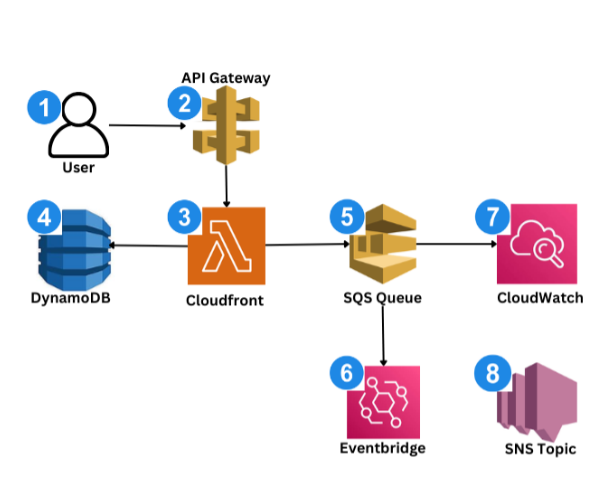

# 🚀 Event-Driven Order Processing System (AWS Serverless Architecture)

A production-style serverless backend system built on AWS that simulates how real-world e-commerce platforms (like Amazon or Jumia) process orders reliably at scale.

This project demonstrates event-driven architecture, asynchronous processing, failure handling, intelligent routing, and full observability using AWS services.

---

## 🧠 System Overview

This system automatically processes customer orders from creation to completion while handling:

- Success workflows
- Business rule failures
- Technical failures (with retries)
- Dead-letter queue (DLQ) handling
- High-value order routing
- Real-time monitoring and alerts

---

## ⚙️ Architecture Flow

1. User places an order via API Gateway  
2. Order is stored in DynamoDB  
3. DynamoDB Streams triggers processing Lambda  
4. Order is sent to SQS queue for async processing  
5. Worker Lambda processes the order:
   - Marks order as COMPLETED (success path)
   - Marks order as FAILED (business rule: high amount)
   - Retries technical failures automatically
6. Failed messages are sent to DLQ after max retries  
7. EventBridge Pipes route high-value orders (>10,000)  
8. High-value orders are processed separately  
9. CloudWatch + SNS send alerts for system failures  

---

## 🧩 AWS Services Used

- AWS Lambda (serverless compute)
- Amazon API Gateway (request handling)
- Amazon DynamoDB (data storage)
- Amazon DynamoDB Streams (event triggers)
- Amazon SQS (message queue)
- Dead Letter Queue (failure isolation)
- Amazon EventBridge Pipes (intelligent routing)
- Amazon CloudWatch (monitoring & logs)
- Amazon SNS (email alerts)

---

## 🚧 Key Features

### ✔ Event-Driven Architecture
Loose coupling between services using events and queues.

### ✔ Fault Tolerance
Automatic retries + DLQ for failed messages.

### ✔ Intelligent Routing
High-value orders are routed to a separate workflow.

### ✔ Observability
CloudWatch alarms + SNS notifications for real-time failure detection.

### ✔ Scalable Design
Asynchronous processing ensures the system handles high traffic without breaking.

---

## 🧪 Business Logic Rules

- Orders > 10,000 → Marked as FAILED (business rule)
- Orders containing “FAIL” → Simulated technical failure (triggers retry + DLQ)
- Normal orders → Marked as COMPLETED

---
## 🏗 Architecture Diagram

This diagram shows the full event-driven flow of the system:

- Order creation
- Async processing
- Failure handling
- Intelligent routing
- Observability layer

## 🚨 Failure Handling Strategy

- 1st failure → retry automatically (SQS)
- After max retries → move to DLQ
- DLQ trigger → CloudWatch Alarm
- Alarm → SNS email notification

---

## 📊 What I Learned

- How real production systems process millions of events reliably  
- Why failure handling is more important than success flow  
- How to design loosely coupled distributed systems  
- How observability is critical in cloud architecture  
- How AWS serverless services work together in real-world systems  

---

## 💡 Key Takeaway

> A system is not truly production-ready unless it can fail safely, recover automatically, and alert you when something goes wrong.

---

## 🛠️ Future Improvements

- Add Step Functions for orchestration  
- Add fraud detection service for high-value orders  
- Add API authentication (Cognito / JWT)  
- Add dashboards (CloudWatch metrics or Grafana)  
- Add idempotency keys for duplicate prevention  

---

## 👨‍💻 Author

**Adedeji Adesanya**  
Aspiring Cloud & DevOps Engineer | AWS Enthusiast  

---

## 📌 Tags

`AWS` `Serverless` `Cloud Computing` `DevOps` `Lambda` `SQS` `EventBridge` `DynamoDB` `System Design` `Backend Engineering`
